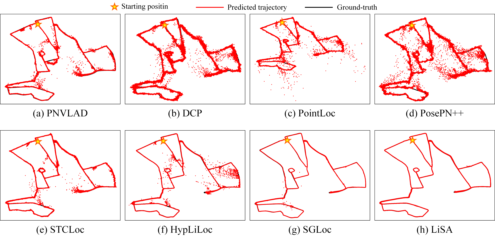
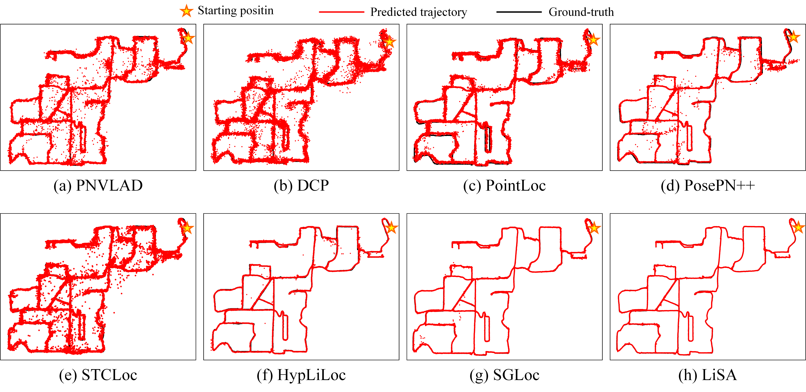

<p align="center">
  <h2 align="center">LiSA: LiDAR Localization with Semantic Awareness</h2>
  <h3 align="center">CVPR 2024 Highlight</h3>

<a href="https://openaccess.thecvf.com/content/CVPR2024/papers/Yang_LiSA_LiDAR_Localization_with_Semantic_Awareness_CVPR_2024_paper.pdf"></a>
</p>

<table align="center">
    <tr>
        
    </tr>
  </table>


## Environment

- Spconv
```
conda install -f lisa-spconv.yaml
conda activate lisa-spconv
cd LiSA-spconv/third_party
python setup.py install
```

- MinkowskiEngine
```
conda install -f lisa-mink.yaml
```

## Dataset

We support the [Oxford Radar RobotCar](https://oxford-robotics-institute.github.io/radar-robotcar-dataset/datasets) and [NCLT](https://robots.engin.umich.edu/nclt/) datasets right now.

We also use [PQEE](https://github.com/liw95/SGLoc/tree/main) to enhance the Oxford and provide the corrected pose, [QEOxford](QEOxford).

The data of the Oxford, QEOxford and NCLT dataset should be organized as follows: 

- (QE)Oxford
```
data_root
├── 2019-01-11-14-02-26-radar-oxford-10k
│   ├── velodyne_left
│   │   ├── xxx.bin
│   │   ├── xxx.bin
│   │   ├── …
│   ├── sphere_velodyne_left_feature32
│   │   ├── xxx.bin
│   │   ├── xxx.bin
│   │   ├── …
│   ├── velodyne_left_calibrateFalse.h5
│   ├── velodyne_left_False.h5
│   ├── rot_tr.bin
│   ├── tr.bin
│   ├── tr_add_mean.bin
├── …
├── (QE)Oxford_pose_stats.txt
├── train_split.txt
├── valid_split.txt
```
- NCLT
```
data_root
├── 2012-01-22
│   ├── velodyne_left
│   │   ├── xxx.bin
│   │   ├── xxx.bin
│   │   ├── …
│   ├── sphere_velodyne_left_feature32
│   │   ├── xxx.bin
│   │   ├── xxx.bin
│   │   ├── …
│   ├── velodyne_left_False.h5
├── …
├── NCLT_pose_stats.txt
├── train_split.txt
├── valid_split.txt
```
The files used are provided in the [dataset](dataset) directory.

## Data prepare
We use [SphereFormer](https://github.com/dvlab-research/SphereFormer) for data preprocessing (just used for training) and generate corresponding semantic feature. You need to download the code, put [dataset.py](data_preprocess/dataset.py) into **util** and put [get_seg_fearure.py](data_preprocess/get_seg_feature.py) into **/**.

## Visualization
#### QEOxford

#### NCLT


## Run

### train
```
CUDA_VISIBLE_DEVICES=0,1 python -m torch.distributed.launch --nproc_per_node=2 --master_addr 127.0.0.34 --master_port 29503 train_ddp.py
```

### test
```
python test.py
```

## Model zoo

The models of SGLoc on Oxford, QEOxford, and NCLT can be downloaded [here](https://drive.google.com/drive/folders/1SjFZehQnAMiMLPi1UTGtIxM4JG-T9dO2?usp=sharing).

## Acknowledgement

 We appreciate the code of [SGLoc](https://github.com/liw95/SGLoc/tree/main),  [SphereFormer](https://github.com/dvlab-research/SphereFormer) and [DiffKD](https://github.com/hunto/DiffKD/tree/main) they shared.

<!-- ## Citation

```

``` -->
